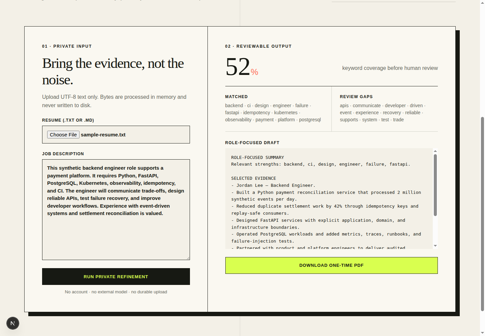

# Refiner

Refiner is a privacy-first reference application for turning a plain-text resume and a job
description into a focused draft and a downloadable PDF. It demonstrates a FastAPI application
boundary, an explicit multi-step workflow, replaceable AI ports, and a Next.js user experience
without requiring an API key or retaining an uploaded document.

> This repository is a clean-room reference implementation. The included resume and job posting
> are synthetic, and the default analyzer is deterministic so the complete flow works offline.

## Problem

Resume tools often mix HTTP handling, model calls, document storage, and formatting in one path.
That makes privacy promises hard to verify and forces contributors to configure a paid model before
they can run a meaningful demo.

## Solution

Refiner separates those concerns and makes the safe path the default:

- uploads are decoded in memory and are never written to disk;
- a workflow coordinates validation, analysis, and rewriting through a small analyzer port;
- the bundled deterministic adapter makes tests and demos repeatable;
- only the derived draft is held for up to 15 minutes behind a hashed, single-use export token;
- consuming the token renders a PDF and removes the draft immediately.

## Architecture

```text
Next.js UI
    |
    v
FastAPI interface -> use case -> refinement workflow -> domain rules
                                      |                    |
                                      v                    v
                               analyzer port         export grant port
                                      |                    |
                                      v                    v
                           deterministic adapter    in-memory hashed store
                                                           |
                                                           v
                                                   minimal PDF renderer
```

The dependency direction is checked in CI: domain code cannot import application, infrastructure,
or web-framework modules; application code depends on ports rather than concrete adapters.
[Architecture details](docs/architecture.md) explain the boundaries and extension points.

## Quickstart

Requirements: Docker with Compose, or Python 3.14 + `uv` 0.9.26 and Node.js 24.

```bash
docker compose up --build
```

Open <http://localhost:3000>. The API is available at <http://localhost:8000>, and its health check
is `GET /health`.

For a credential-free command-line demo:

```bash
uv sync --frozen
uv run python scripts/demo.py
```

The command uses only files under `examples/` and writes a temporary PDF to the operating system's
temporary directory.

## Validation

The same entry point is used locally and in CI:

```bash
python3 scripts/quality.py all
```

It performs a clean dependency install, formatting/lint checks, strict type checking, backend and
frontend tests, a production frontend build, dependency audits, CycloneDX SBOM generation and
parsing, and a dependency-license review. GitHub Actions uses the repository-scoped
`homelab-refiner` ARC runner with no Actions cache or artifact storage.

## Demo

The synthetic fixtures describe a backend engineer and a fictional payment-platform role:



- [`examples/sample-resume.txt`](examples/sample-resume.txt)
- [`examples/job-description.txt`](examples/job-description.txt)

The browser flow is:

1. choose the sample resume;
2. paste the sample job description;
3. review keyword coverage, strengths, and gaps;
4. download the rewritten draft as a PDF;
5. try downloading again to confirm that the export token was consumed.

## Privacy and Security

Refiner does not log document contents, persist uploads, or send them to an external service. Export
tokens are random, stored only as SHA-256 digests, expire after 15 minutes, and can be consumed once.
The public analytics adapter accepts only a small typed event dictionary and never accepts document
text, names, filenames, email addresses, phone numbers, or URLs. See the
[privacy design](docs/privacy.md) and [security policy](SECURITY.md).

## Limitations

- The public demo accepts UTF-8 `.txt` and `.md` resumes, not arbitrary PDF or office documents.
- The deterministic adapter demonstrates orchestration and contracts; it is not a production
  language model and does not claim hiring-quality recommendations.
- Export grants live in one process. Multiple replicas require an external store that preserves
  atomic consume semantics.
- Authentication, accounts, durable resume drafts, production deployment manifests, and model
  provider credentials are intentionally outside this repository.
- A production site must set its canonical origin, keep non-canonical hosts `noindex`, and connect
  consent-gated GA4 through Cloudflare Zaraz; no measurement ID belongs in application code.

## License

[MIT](LICENSE)
